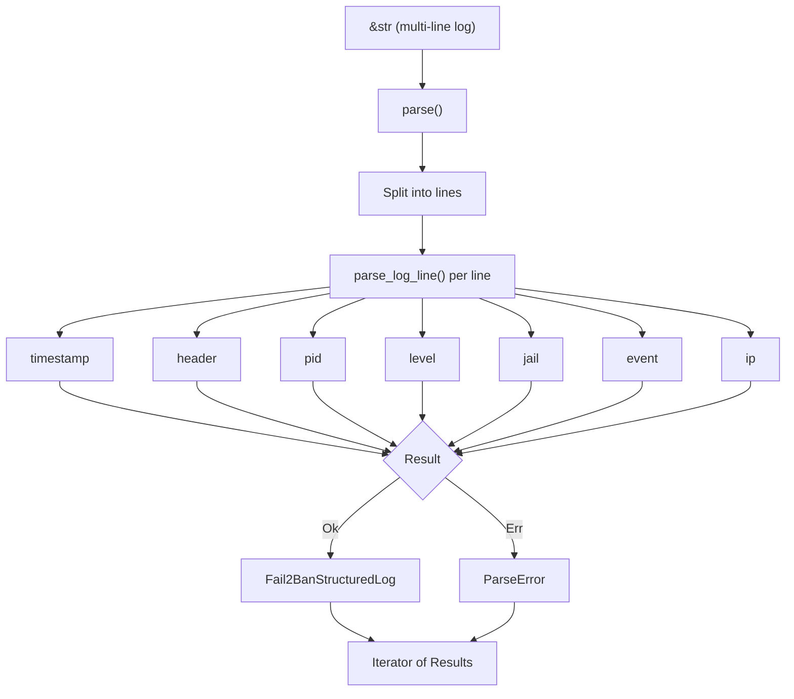

# Fail2Ban log parser

> [!IMPORTANT]
> This library is still WIP.

## Installation

```sh
cargo add fail2ban-log-parser-core
```

With serde support:

```sh
cargo add fail2ban-log-parser-core --features serde
```

## Usage

### Parse a single line

```rust
use fail2ban_log_parser_core::parse;

let line = "2024-01-15 14:32:01,847 fail2ban.filter [12345] INFO [sshd] Found 192.168.1.1";
let log = parse(line).next().unwrap().unwrap();

assert_eq!(log.jail(), Some("sshd"));
assert_eq!(log.pid(), Some(12345));
println!("{:?} {:?} {:?}", log.event(), log.ip(), log.timestamp());
```

### Parse a batch and handle errors

```rust
use fail2ban_log_parser_core::parse;

let input = "\
2024-01-15 14:32:01,847 fail2ban.filter [12345] INFO [sshd] Found 192.168.1.100
this line is not a valid log entry
2024-01-15 14:32:03,456 fail2ban.actions [12345] NOTICE [sshd] Ban 192.168.1.100";

for result in parse(input) {
    match result {
        Ok(log) => println!("{:?} {:?}", log.event(), log.ip()),
        Err(e) => eprintln!("parse error: {e}"),
    }
}
```

### Filter specific events

```rust
use fail2ban_log_parser_core::{Fail2BanEvent, parse};

let input = "..."; // multi-line log
let bans: Vec<_> = parse(input)
    .filter_map(|r| r.ok())
    .filter(|log| log.event() == Some(&Fail2BanEvent::Ban))
    .collect();
```

## Log structure

```text
2024-01-15 14:32:01,847  fail2ban.filter  [12345]  INFO  [sshd] Found 1.2.3.4
|___________________|    |______________|  |____|   |__|  |____| |__| |______|
    timestamp              header            pid    level  jail  event  IP address
```

### Supported formats

| Field | Formats |
|---|---|
| Timestamp | `2024-01-15 14:32:01,847`, `Jan 15 2024 14:32:01,847`, `2024-01-15T14:32:01,847Z`, `±HH:MM` offset |
| Header | `fail2ban.filter`, `fail2ban.actions`, `fail2ban.server` |
| Level | `INFO`, `NOTICE`, `WARNING`, `ERROR`, `DEBUG` (case-insensitive) |
| Event | `Found`, `Ban`, `Unban`, `Restore`, `Ignore`, `AlreadyBanned`, `Failed`, `Unknown` |
| IP | IPv4 (`192.168.1.1`) and IPv6 (`2001:db8::1`) |

## API

| Type | Description |
|---|---|
| `parse(&str)` | Returns a lazy `Iterator<Item = Result<Fail2BanStructuredLog, ParseError>>` |
| `Fail2BanStructuredLog` | Parsed log line with accessor methods: `timestamp()`, `header()`, `pid()`, `level()`, `jail()`, `event()`, `ip()` |
| `Fail2BanEvent` | Enum: `Found`, `Ban`, `Unban`, `Restore`, `Ignore`, `AlreadyBanned`, `Failed`, `Unknown` |
| `Fail2BanHeaderType` | Enum: `Filter`, `Actions`, `Server` |
| `Fail2BanLevel` | Enum: `Info`, `Notice`, `Warning`, `Error`, `Debug` |
| `ParseError` | Contains `line_number: usize` and `line: String` |

### Features

| Feature | Description |
|---|---|
| `serde` | Enables `Serialize`/`Deserialize` on all public types |
| `debug_errors` | Extra error debugging information |

## Examples

```sh
cargo run -p fail2ban-log-parser-core --example parse_single
cargo run -p fail2ban-log-parser-core --example parse_batch
cargo run -p fail2ban-log-parser-core --example filter_bans
```

## How it works



## Benchmarks

Measured with [Criterion.rs](https://github.com/criterion-rs/criterion.rs) + [dhat](https://docs.rs/dhat) on Apple M4 Pro / 48 GB / rustc 1.94.0.

Performance evolution can be seen [here](https://adrianvillanueva997.github.io/fail2ban-log-parser/).

### Single-line parsing

| Variant | Time |
|---|---|
| ISO date + IPv4 | ~138 ns |
| Syslog date | ~145 ns |
| ISO 8601 (T-separator) | ~141 ns |
| IPv6 address | ~158 ns |

### Batch parsing (throughput)

| Lines | Time | Per line |
|---|---|---|
| 10 | ~1.57 µs | ~157 ns |
| 100 | ~16.4 µs | ~164 ns |
| 1,000 | ~165 µs | ~165 ns |
| 10,000 | ~1.66 ms | ~166 ns |
| 100,000 | ~16.7 ms | ~167 ns |
| 1,000,000 | ~167 ms | ~167 ns |

### Collection strategies (1,000 lines)

| Strategy | Time |
|---|---|
| Iterate + count | ~166 µs |
| Collect to Vec | ~171 µs |
| Partition ok/err | ~170 µs |

### Error handling

| Scenario | Time |
|---|---|
| 1,000 lines (50% invalid) | ~94 µs |
| All 8 event types (8 lines) | ~1.31 µs |

### Memory usage (collect to Vec)

| Lines | Total allocated | Peak in-use | Allocs | Per line |
|---|---|---|---|---|
| 1 | 260 B | 260 B | 2 | 260 B |
| 100 | 16.14 KB | 8.39 KB | 106 | 165 B |
| 1,000 | 131.66 KB | 67.91 KB | 1,009 | 134 B |
| 10,000 | 2.04 MB | 1.04 MB | 10,013 | 213 B |
| 100,000 | 16.38 MB | 8.38 MB | 100,016 | 171 B |
| 1,000,000 | 131.81 MB | 67.81 MB | 1,000,019 | 138 B |

To reproduce:

```sh
cargo bench -p fail2ban-log-parser-core --bench parsing
```
