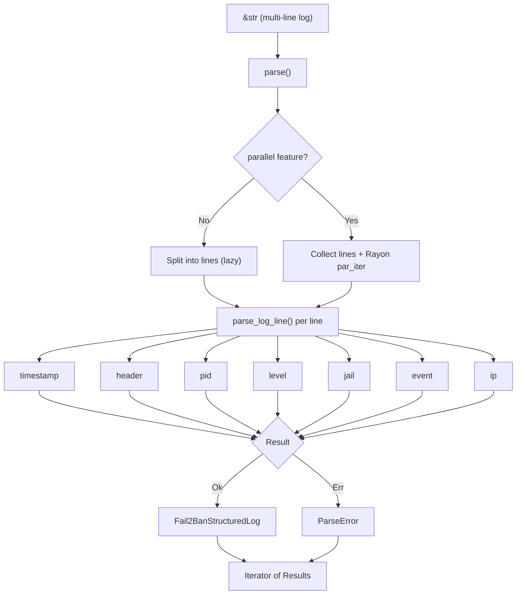

# Fail2Ban log parser

> [!IMPORTANT]
> This library is still WIP.

## Installation

```sh
cargo add fail2ban-log-parser-core
```

With serde support:

```sh
cargo add fail2ban-log-parser-core --features serde
```

With parallel parsing (multi-threaded via Rayon):

```sh
cargo add fail2ban-log-parser-core --features parallel
```

## Usage

### Parse a single line

```rust
use fail2ban_log_parser_core::parse;

let line = "2024-01-15 14:32:01,847 fail2ban.filter [12345] INFO [sshd] Found 192.168.1.1";
let log = parse(line).next().unwrap().unwrap();

assert_eq!(log.jail(), Some("sshd"));
assert_eq!(log.pid(), Some(12345));
println!("{:?} {:?} {:?}", log.event(), log.ip(), log.timestamp());
```

### Parse a batch and handle errors

```rust
use fail2ban_log_parser_core::parse;

let input = "\
2024-01-15 14:32:01,847 fail2ban.filter [12345] INFO [sshd] Found 192.168.1.100
this line is not a valid log entry
2024-01-15 14:32:03,456 fail2ban.actions [12345] NOTICE [sshd] Ban 192.168.1.100";

for result in parse(input) {
    match result {
        Ok(log) => println!("{:?} {:?}", log.event(), log.ip()),
        Err(e) => eprintln!("parse error: {e}"),
    }
}
```

### Filter specific events

```rust
use fail2ban_log_parser_core::{Fail2BanEvent, parse};

let input = "..."; // multi-line log
let bans: Vec<_> = parse(input)
    .filter_map(|r| r.ok())
    .filter(|log| log.event() == Some(&Fail2BanEvent::Ban))
    .collect();
```

## Log structure

```text
2024-01-15 14:32:01,847  fail2ban.filter  [12345]  INFO  [sshd] Found 1.2.3.4
|___________________|    |______________|  |____|   |__|  |____| |__| |______|
    timestamp              header            pid    level  jail  event  IP address
```

### Supported formats

| Field | Formats |
|---|---|
| Timestamp | `2024-01-15 14:32:01,847`, `Jan 15 2024 14:32:01,847`, `2024-01-15T14:32:01,847Z`, `±HH:MM` offset |
| Header | `fail2ban.filter`, `fail2ban.actions`, `fail2ban.server` |
| Level | `INFO`, `NOTICE`, `WARNING`, `ERROR`, `DEBUG` (case-insensitive) |
| Event | `Found`, `Ban`, `Unban`, `Restore`, `Ignore`, `AlreadyBanned`, `Failed`, `Unknown` |
| IP | IPv4 (`192.168.1.1`) and IPv6 (`2001:db8::1`) |

## API

| Type | Description |
|---|---|
| `parse(&str)` | Returns an `Iterator<Item = Result<Fail2BanStructuredLog, ParseError>>`. Sequential by default; with the `parallel` feature, lines are parsed concurrently via Rayon (same API). |
| `Fail2BanStructuredLog` | Parsed log line with accessor methods: `timestamp()`, `header()`, `pid()`, `level()`, `jail()`, `event()`, `ip()` |
| `Fail2BanEvent` | Enum: `Found`, `Ban`, `Unban`, `Restore`, `Ignore`, `AlreadyBanned`, `Failed`, `Unknown` |
| `Fail2BanHeaderType` | Enum: `Filter`, `Actions`, `Server` |
| `Fail2BanLevel` | Enum: `Info`, `Notice`, `Warning`, `Error`, `Debug` |
| `ParseError` | Contains `line_number: usize` and `line: String` |

### Features

| Feature | Description |
|---|---|
| `serde` | Enables `Serialize`/`Deserialize` on all public types |
| `parallel` | Multi-threaded parsing via [Rayon](https://docs.rs/rayon). Same `parse()` API, lines parsed concurrently. Not available on WASM targets. |
| `debug_errors` | Extra error debugging information |

## Examples

```sh
cargo run -p fail2ban-log-parser-core --example parse_single
cargo run -p fail2ban-log-parser-core --example parse_batch
cargo run -p fail2ban-log-parser-core --example filter_bans
```

## How it works



## Benchmarks

Measured with [Criterion.rs](https://github.com/criterion-rs/criterion.rs) + [dhat](https://docs.rs/dhat) on Apple M4 Pro (12 cores) / 48 GB / rustc 1.94.0.

Performance evolution can be seen [here](https://adrianvillanueva997.github.io/fail2ban-log-parser/).

### Single-line parsing

Time to parse one log line in isolation.

| Variant | Time |
|---|---|
| ISO date + IPv4 | ~121 ns |
| Syslog date | ~127 ns |
| ISO 8601 (T-separator) | ~121 ns |
| IPv6 address | ~144 ns |

### Batch parsing

#### Sequential (default)

Single-threaded, lazy iterator. Each line is parsed on demand.

| Lines | Total time | Per line |
|---|---|---|
| 10 | ~1.35 µs | ~135 ns |
| 100 | ~14.1 µs | ~141 ns |
| 1,000 | ~142 µs | ~142 ns |
| 10,000 | ~1.42 ms | ~142 ns |
| 100,000 | ~14.3 ms | ~143 ns |
| 1,000,000 | ~143 ms | ~143 ns |

#### Parallel (`--features parallel`)

Multi-threaded via Rayon. All lines are parsed concurrently, then yielded in order.

| Lines | Total time | Per line | Speedup |
|---|---|---|---|
| 1,000 | ~114 µs | ~114 ns | 1.2x |
| 10,000 | ~442 µs | ~44 ns | 3.2x |
| 100,000 | ~2.77 ms | ~28 ns | 5.2x |
| 1,000,000 | ~26.3 ms | ~26 ns | **5.4x** |

> Parallel overhead makes it slower than sequential for small inputs (<1,000 lines).
> The speedup scales with core count, expect different results on different hardware.

### Collection strategies

Time to process 1,000 lines (sequential) with different consumption patterns.

| Strategy | Time |
|---|---|
| Iterate + count | ~144 µs |
| Collect to `Vec` | ~150 µs |
| Partition ok/err | ~147 µs |

### Error handling

| Scenario | Time |
|---|---|
| 1,000 lines (50% invalid) | ~81 µs |
| All 8 event types (8 lines) | ~1.14 µs |

### Memory usage (sequential, collect to `Vec`)

Heap allocations when collecting all parsed results into a `Vec`. Measured with [dhat](https://docs.rs/dhat).

| Lines | Total allocated | Peak in-use | Alloc count | Per line |
|---|---|---|---|---|
| 1 | 224 B | 224 B | 1 | 224 B |
| 100 | 13.78 KB | 7.00 KB | 6 | 141 B |
| 1,000 | 111.78 KB | 56.00 KB | 9 | 114 B |
| 10,000 | 1.75 MB | 896.00 KB | 13 | 183 B |
| 100,000 | 14.00 MB | 7.00 MB | 16 | 146 B |
| 1,000,000 | 112.00 MB | 56.00 MB | 19 | 117 B |

> The low alloc count (19 for 1M lines) is because `Fail2BanStructuredLog` borrows from the input, only the `Vec` itself and its backing buffer are heap-allocated.

### Reproduce

```sh
# Sequential benchmarks
cargo bench -p fail2ban-log-parser-core --bench parsing

# Parallel benchmarks (requires parallel feature)
cargo bench -p fail2ban-log-parser-core --bench parsing --features parallel
```
