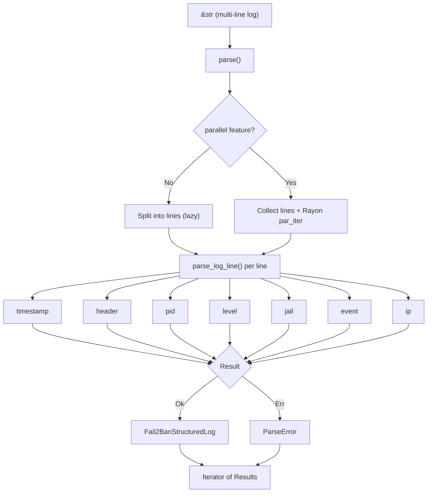

# fail2ban-log-parser

Fast, zero-copy fail2ban log parser with bindings for **Rust**, **Python**, and **JavaScript**.

[](https://crates.io/crates/fail2ban-log-parser-core)
[](https://docs.rs/fail2ban-log-parser-core)
[](https://pypi.org/project/fail2ban-log-parser/)
[](LICENSE)
[](https://adrianvillanueva997.github.io/fail2ban-log-parser/)

Parse fail2ban logs at **~142 ns/line** with **19 heap allocations per million lines**, `Fail2BanStructuredLog` borrows directly from the input, so only the output `Vec` and its backing buffer are heap-allocated. Enable the `parallel` feature for up to **5.4× speedup** on large inputs via Rayon.

---

## Installation

### Rust

```sh
cargo add fail2ban-log-parser-core
```

With serde support:

```sh
cargo add fail2ban-log-parser-core --features serde
```

With parallel parsing (multi-threaded via Rayon):

```sh
cargo add fail2ban-log-parser-core --features parallel
```

### Python

```sh
pip install fail2ban-log-parser
```

Requires Python 3.10+. Prebuilt wheels are available for Linux (x86_64, aarch64), macOS (x86_64, aarch64), and Windows (x86_64).

---

## Usage

### Rust

#### Parse a single line

```rust
use fail2ban_log_parser_core::parse;

let line = "2024-01-15 14:32:01,847 fail2ban.filter [12345] INFO [sshd] Found 192.168.1.1";
let log = parse(line).next().unwrap().unwrap();

assert_eq!(log.jail(), Some("sshd"));
assert_eq!(log.pid(), Some(12345));
println!("{:?} {:?} {:?}", log.event(), log.ip(), log.timestamp());
```

> **Note:** Parsed results borrow from the input `&str`, the input buffer must outlive the iterator and any collected results.

#### Parse a batch and handle errors

```rust
use fail2ban_log_parser_core::parse;

let input = "\
2024-01-15 14:32:01,847 fail2ban.filter [12345] INFO [sshd] Found 192.168.1.100
this line is not a valid log entry
2024-01-15 14:32:03,456 fail2ban.actions [12345] NOTICE [sshd] Ban 192.168.1.100";

for result in parse(input) {
    match result {
        Ok(log) => println!("{:?} {:?}", log.event(), log.ip()),
        Err(e) => eprintln!("parse error: {e}"),
    }
}
```

#### Filter specific events

```rust
use fail2ban_log_parser_core::{Fail2BanEvent, parse};

let input = "..."; // multi-line log
let bans: Vec<_> = parse(input)
    .filter_map(|r| r.ok())
    .filter(|log| log.event() == Some(&Fail2BanEvent::Ban))
    .collect();
```

### Python

#### Parse a single line

```python
from fail2ban_log_parser import parse, Event

line = "2024-01-15 14:32:01,847 fail2ban.filter [12345] INFO [sshd] Found 192.168.1.1"
logs, errors = parse(line)

log = logs[0]
print(log.timestamp)  # "2024-01-15T14:32:01.847+00:00"
print(log.jail)       # "sshd"
print(log.event)      # Event.Found
print(log.ip)         # "192.168.1.1"
print(log.pid)        # 12345
```

#### Parse a batch and handle errors

```python
from fail2ban_log_parser import parse

input_text = """\
2024-01-15 14:32:01,847 fail2ban.filter [12345] INFO [sshd] Found 192.168.1.100
this line is not a valid log entry
2024-01-15 14:32:03,456 fail2ban.actions [12345] NOTICE [sshd] Ban 192.168.1.100"""

logs, errors = parse(input_text)

for log in logs:
    print(f"{log.event} {log.ip} in jail {log.jail}")

for err in errors:
    print(f"Line {err.line_number}: {err.line}")
```

#### Filter bans

```python
from fail2ban_log_parser import parse, Event

logs, _ = parse(open("/var/log/fail2ban.log").read())
bans = [log for log in logs if log.event == Event.Ban]

for ban in bans:
    print(f"Banned {ban.ip} from {ban.jail} at {ban.timestamp}")
```

#### Group events by jail

```python
from collections import defaultdict
from fail2ban_log_parser import parse

logs, _ = parse(open("/var/log/fail2ban.log").read())

by_jail = defaultdict(list)
for log in logs:
    if log.jail:
        by_jail[log.jail].append(log)

for jail, entries in by_jail.items():
    print(f"{jail}: {len(entries)} events")
```

---

## Log structure

```
2024-01-15 14:32:01,847  fail2ban.filter  [12345]  INFO  [sshd] Found 1.2.3.4
|___________________|    |______________|  |____|   |__|  |____| |__| |______|
    timestamp              header            pid    level  jail  event  IP
```

### Supported formats

| Field | Formats |
|---|---|
| Timestamp | `2024-01-15 14:32:01,847`, `Jan 15 2024 14:32:01,847`, `2024-01-15T14:32:01,847Z`, `±HH:MM` offset |
| Header | `fail2ban.filter`, `fail2ban.actions`, `fail2ban.server` |
| Level | `INFO`, `NOTICE`, `WARNING`, `ERROR`, `DEBUG` (case-insensitive) |
| Event | `Found`, `Ban`, `Unban`, `Restore`, `Ignore`, `AlreadyBanned`, `Failed`, `Unknown` |
| IP | IPv4 (`192.168.1.1`) and IPv6 (`2001:db8::1`) |

---

## API

### Rust

| Type | Description |
|---|---|
| `parse(&str)` | Returns `Iterator<Item = Result<Fail2BanStructuredLog, ParseError>>`. Sequential by default; with `parallel`, lines are parsed concurrently via Rayon (same API). |
| `Fail2BanStructuredLog` | Parsed log line. Accessor methods: `timestamp()`, `header()`, `pid()`, `level()`, `jail()`, `event()`, `ip()`. Borrows from input — input must outlive results. |
| `Fail2BanEvent` | Enum: `Found`, `Ban`, `Unban`, `Restore`, `Ignore`, `AlreadyBanned`, `Failed`, `Unknown` |
| `Fail2BanHeaderType` | Enum: `Filter`, `Actions`, `Server` |
| `Fail2BanLevel` | Enum: `Info`, `Notice`, `Warning`, `Error`, `Debug` |
| `ParseError` | Contains `line_number: usize` and `line: String` |

### Python

| Type | Description |
|---|---|
| `parse(input: str)` | Returns `(list[Fail2BanLog], list[ParseError])`. |
| `Fail2BanLog` | Parsed log line. Properties: `timestamp` (RFC 3339), `header`, `pid`, `level`, `jail`, `event`, `ip` — all `Optional`. |
| `Event` | Enum: `Found`, `Ban`, `Unban`, `Restore`, `Ignore`, `AlreadyBanned`, `Failed`, `Unknown` |
| `HeaderType` | Enum: `Filter`, `Actions`, `Server` |
| `Level` | Enum: `Info`, `Notice`, `Warning`, `Error`, `Debug` |
| `ParseError` | Properties: `line_number` (int), `line` (str) |

### Features

| Feature | Description |
|---|---|
| `serde` | Enables `Serialize`/`Deserialize` on all public types |
| `parallel` | Multi-threaded parsing via Rayon. Same `parse()` API, lines parsed concurrently. Not supported on `wasm32` targets (compile-time error). |
| `debug_errors` | Extra error context for debugging parse failures |

---

## How it works



The parser is built with [winnow](https://docs.rs/winnow), a fast parser combinator library. Each log line is parsed in a single pass with no intermediate allocations, `Fail2BanStructuredLog` holds `&str` slices into the original input rather than owned strings.

---

## Benchmarks

Measured with [Criterion.rs](https://github.com/criterion-rs/criterion.rs) + [dhat](https://docs.rs/dhat) on Apple M4 Pro (12 cores) / 48 GB / rustc 1.94.0.

📈 [View full benchmark history](https://adrianvillanueva997.github.io/fail2ban-log-parser/)

### Single-line parsing

| Variant | Time |
|---|---|
| ISO date + IPv4 | ~121 ns |
| Syslog date | ~127 ns |
| ISO 8601 (T-separator) | ~121 ns |
| IPv6 address | ~144 ns |

### Batch parsing — sequential (default)

Single-threaded, lazy iterator. Each line is parsed on demand.

| Lines | Total time | Per line |
|---|---|---|
| 10 | ~1.35 µs | ~135 ns |
| 100 | ~14.1 µs | ~141 ns |
| 1,000 | ~142 µs | ~142 ns |
| 10,000 | ~1.42 ms | ~142 ns |
| 100,000 | ~14.3 ms | ~143 ns |
| 1,000,000 | ~143 ms | ~143 ns |

### Batch parsing — parallel (`--features parallel`)

Multi-threaded via Rayon. Lines are parsed concurrently, then yielded in order.

| Lines | Total time | Per line | Speedup |
|---|---|---|---|
| 1,000 | ~114 µs | ~114 ns | 1.2× |
| 10,000 | ~442 µs | ~44 ns | 3.2× |
| 100,000 | ~2.77 ms | ~28 ns | 5.2× |
| 1,000,000 | ~26.3 ms | ~26 ns | **5.4×** |

> Parallel overhead makes it slower than sequential for inputs under ~1,000 lines. Speedup scales with core count.

### Collection strategies (1,000 lines, sequential)

| Strategy | Time |
|---|---|
| Iterate + count | ~144 µs |
| Collect to `Vec` | ~150 µs |
| Partition ok/err | ~147 µs |

### Error handling

| Scenario | Time |
|---|---|
| 1,000 lines (50% invalid) | ~81 µs |
| All 8 event types (8 lines) | ~1.14 µs |

### Memory usage (sequential, collect to `Vec`)

Heap allocations measured with [dhat](https://docs.rs/dhat). The low allocation count reflects the zero-copy design,  only the `Vec` itself and its backing buffer are heap-allocated; all string fields borrow from the input.

| Lines | Total allocated | Peak in-use | Alloc count | Per line |
|---|---|---|---|---|
| 1 | 224 B | 224 B | 1 | 224 B |
| 100 | 13.78 KB | 7.00 KB | 6 | 141 B |
| 1,000 | 111.78 KB | 56.00 KB | 9 | 114 B |
| 10,000 | 1.75 MB | 896.00 KB | 13 | 183 B |
| 100,000 | 14.00 MB | 7.00 MB | 16 | 146 B |
| 1,000,000 | 112.00 MB | 56.00 MB | **19** | 117 B |

### Reproduce

```sh
# Sequential benchmarks
cargo bench -p fail2ban-log-parser-core --bench parsing

# Parallel benchmarks
cargo bench -p fail2ban-log-parser-core --bench parsing --features parallel
```

---

## Examples

```sh
cargo run -p fail2ban-log-parser-core --example parse_single
cargo run -p fail2ban-log-parser-core --example parse_batch
cargo run -p fail2ban-log-parser-core --example filter_bans
```

---

## License

Apache-2.0,  see [LICENSE](LICENSE).
